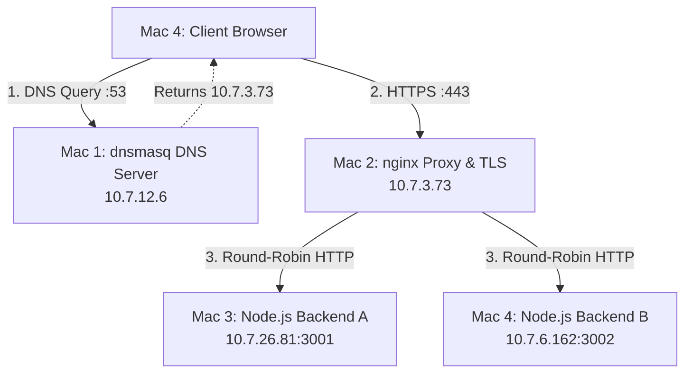

# 🌐 Computer Networks Project — Phase 1
> **Team Jarvis 07** | Private LAN Infrastructure: DNS, Load Balancing, HTTPS/TLS, Caching & Packet Analysis

Welcome to the Team Jarvis 07 Computer Networks project repository! This project simulates a **production-grade web architecture** deployed across a private local area network (LAN). It was built from scratch across four independent physical Apple Mac machines to practically demonstrate how the fundamental protocols of the internet interact.

---

## 📖 Project Objective
The goal of this project is to build and analyze a complete network stack without relying on cloud providers or magical "all-in-one" tools. By running each layer on a distinct physical machine, we can intercept, analyze, and purposefully break the network to observe protocol behavior. 

This repository contains all the configuration files, backend code, TLS certificates, testing scripts, and packet capture evidence for the project.

---

## 👥 Meet the Team

| Name | Role / Subsystem | Physical Machine | IP Address | Enrollment |
|------|------------------|------------------|------------|------------|
| **Vipul Sharma** | Private DNS Server (`dnsmasq`) | Mac 1 | `10.7.12.6` | 2401010505 |
| **Utkarsh Jain** | Reverse Proxy & TLS (`nginx`) | Mac 2 | `10.7.3.73` | 2401020072 |
| **Anant Jain** | Web Backend A (Node.js) | Mac 3 | `10.7.26.81` | 2401010066 |
| **Krishna Gehlot** | Web Backend B / Client / Wireshark | Mac 4 | `10.7.6.162` | 2401010236 |

---

## 🏗️ Architecture & Request Flow

Instead of standard `localhost` development, we use custom domain names (`app.team1.test` and `api.team1.test`) that are resolved locally and routed through a secure, load-balanced proxy before hitting the backend applications.



### What happens when you visit `https://app.team1.test/api/status`?
1. **DNS (Layer 7)**: The client machine asks Mac 1 (Vipul) where `app.team1.test` lives.
2. **TCP (Layer 4)**: The client performs a 3-way handshake (SYN, SYN-ACK, ACK) with Mac 2 (Utkarsh) on port 443.
3. **TLS (Layer 6/7)**: Mac 2 presents a custom `app.crt` certificate. The client verifies it against our `Team1 Local CA` and establishes an encrypted tunnel.
4. **HTTP Proxying & Load Balancing (Layer 7)**: Mac 2 decrypts the request and forwards it to either Mac 3 (Anant) or Mac 4 (Krishna) using a round-robin algorithm.
5. **Backend Processing**: The Node.js server generates a JSON response, tagging it with an `X-Backend: A` or `B` header, and sends it back through the proxy to the client.

---

## 🛠️ Core Technologies Used
* **DNS**: `dnsmasq` — chosen for its lightweight, easy-to-configure local DNS resolution capabilities.
* **Reverse Proxy / Load Balancer**: `nginx` — the industry standard for high-performance HTTP proxying, connection pooling, and SSL termination.
* **Backend Application**: `Node.js` + `Express` — allows us to easily control HTTP headers (like `ETag` and `Cache-Control`) to demonstrate caching.
* **Security**: `OpenSSL` — used to become our own Certificate Authority (CA) and issue valid SAN (Subject Alternative Name) certificates.
* **Analysis**: `Wireshark` — used to capture and inspect the raw packets on the wire.

---

## 🚀 How to Run the Project

If you are evaluating this project, you can find the complete setup instructions broken down by component.

### 1. Start the DNS Server
On **Mac 1** (Vipul):
```bash
brew install dnsmasq
sudo cp config/dnsmasq.conf /usr/local/etc/dnsmasq.conf
sudo brew services start dnsmasq
```
*Note: Ensure all client machines run `./scripts/set-dns.sh 10.7.12.6` to use this DNS server.*

### 2. Start the nginx Proxy
On **Mac 2** (Utkarsh):
```bash
brew install nginx
sudo cp config/nginx.conf /usr/local/etc/nginx/nginx.conf
# Generate and install TLS certs via tls/generate-certs.sh
sudo nginx
```

### 3. Start the Backends
On **Mac 3** (Anant):
```bash
cd backend && npm install && node server.js A 3001
```
On **Mac 4** (Krishna):
```bash
cd backend && npm install && node server.js B 3002
```

---

## 🧪 Testing & Verification

We have written several bash scripts to prove the network is functioning correctly. You can find these in the [`scripts/`](scripts/) directory.

* [`./scripts/test-dns.sh`](scripts/test-dns.sh) — Proves Mac 1 is resolving our custom `.test` domains.
* [`./scripts/test-load-balancing.sh`](scripts/test-load-balancing.sh) — Proves nginx is distributing traffic 50/50 between Backend A and Backend B.
* [`./scripts/test-https.sh`](scripts/test-https.sh) — Proves the TLS certificates are trusted by the OS (runs `curl` without the insecure `-k` flag).
* [`./scripts/test-cache.sh`](scripts/test-cache.sh) — Proves HTTP `304 Not Modified` caching is working using `ETag` matching.

---

## 💥 Breaking the Network (Failure Demos)
To prove we understand the stack, we deliberately broke it in 5 different ways. See the [`failure-demos/`](failure-demos/) folder for details on how we triggered and diagnosed:

1. **NXDOMAIN**: What happens when the DNS server is unreachable.
2. **Connection Refused (TCP)**: What happens when DNS points to a machine with closed ports.
3. **nginx Failover**: What happens when one backend crashes (nginx automatically routes around the failure).
4. **502 Bad Gateway**: What happens when all backends crash but nginx is still alive.
5. **Port Mismatch**: What happens when requesting HTTPS over the wrong TCP port.

---

## 📁 Repository Guide
Here is where you can find everything in this repository:

* 📁 **`backend/`** — The Node.js Express server source code.
* 📁 **`config/`** — Raw configuration files for `nginx` and `dnsmasq`.
* 📁 **`docs/`** — Detailed task-by-task documentation and Viva (oral exam) preparation notes.
* 📁 **`evidence/`** — Organized screenshots of terminal outputs verifying every stage of the project.
* 📁 **`failure-demos/`** — Scripts and docs showing what happens when the network breaks.
* 📁 **`report/`** — The final compiled **PDF Project Report** and demonstration script.
* 📁 **`scripts/`** — Automated shell scripts for verifying DNS, Load Balancing, Caching, and TLS.
* 📁 **`tls/`** — Scripts to act as our own Certificate Authority (CA) and sign SSL certificates.
* 📁 **`wireshark/`** — Packet capture filters and screenshot evidence of the DNS, TCP, and TLS handshakes.
