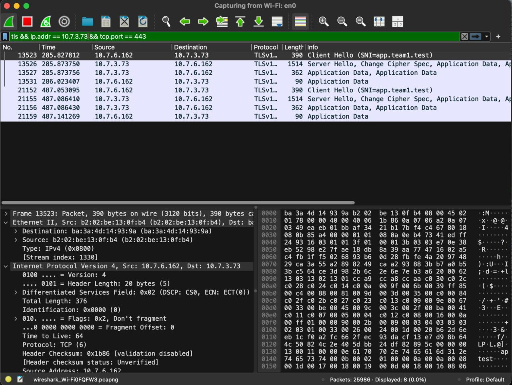
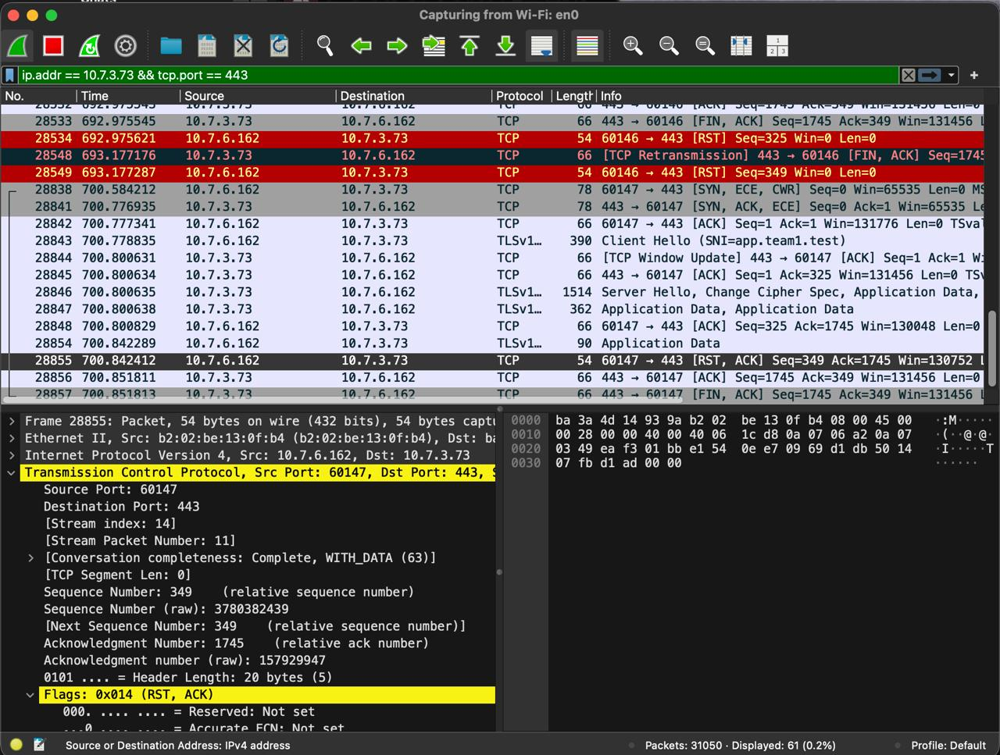
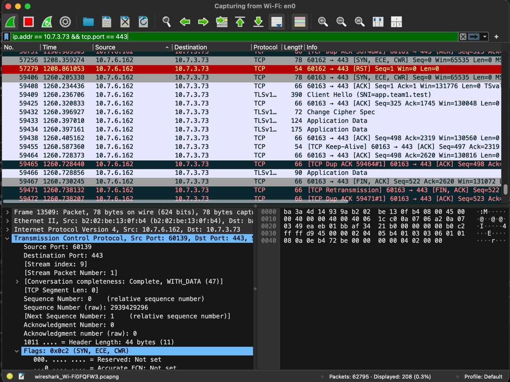
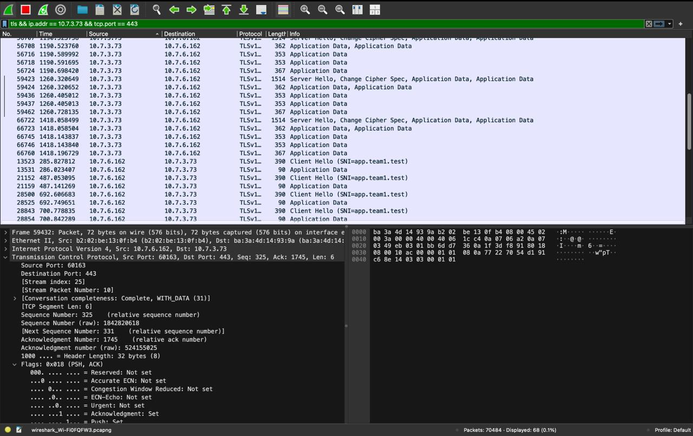

# Wireshark Capture — Team Jarvis 07

## Capture Machine

| Setting    | Value           |
|------------|-----------------|
| Machine    | Mac 4 — Krishna Gehlot (10.7.6.162) |
| Interface  | `en0`           |
| File       | `phase1.pcapng` |

## What the Capture Demonstrates

The Wireshark packet capture shows the complete lifecycle of an HTTPS request:

1. **DNS resolution** — client queries Mac 1 for `app.team1.test`
2. **TCP 3-way handshake** — SYN, SYN-ACK, ACK to Mac 2 on port 443
3. **TLS handshake** — Client Hello, Server Hello, certificate exchange
4. **Encrypted application data** — the actual HTTP request/response inside TLS
5. **TCP teardown** — FIN/ACK

## How to Capture

1. Open Wireshark on Mac 4
2. Select interface `en0`
3. Start capture
4. From Mac 4, run:

```bash
/usr/bin/curl -v --tlsv1.2 --tls-max 1.2 https://app.team1.test/api/status
```

5. Stop capture
6. Save as `phase1.pcapng`

## Why TLS 1.2?

We use `--tlsv1.2 --tls-max 1.2` to force TLS 1.2 for the capture. This makes the TLS handshake easier to analyze in Wireshark because:

- TLS 1.2 shows the **Certificate** message in cleartext (visible in Wireshark)
- TLS 1.3 encrypts more of the handshake, making certificate details harder to inspect

Normal HTTPS requests may negotiate TLS 1.3, which is fine for production but harder to demonstrate in a packet capture.

## Capture Screenshots

### TLS Session Filter

*Filter: `tls && ip.addr == 10.7.3.73 && tcp.port == 443` — Client Hello (SNI=app.team1.test), Server Hello, Application Data*

### TCP + TLS Lifecycle

*Complete connection lifecycle: SYN, Client Hello, Server Hello, Application Data, RST/ACK, FIN/ACK*

### TCP SYN + TLS Handshake

*TCP SYN establishing connection to port 443, followed by TLS Change Cipher Spec*

### TLS Overview (Multiple Sessions)

*Multiple HTTPS sessions showing Client Hello, Server Hello, and encrypted Application Data*

## Filters

See [filters.md](filters.md) for the Wireshark display filters used in the analysis.

## Note

The actual `phase1.pcapng` file is not committed to Git (it is in `.gitignore`).
